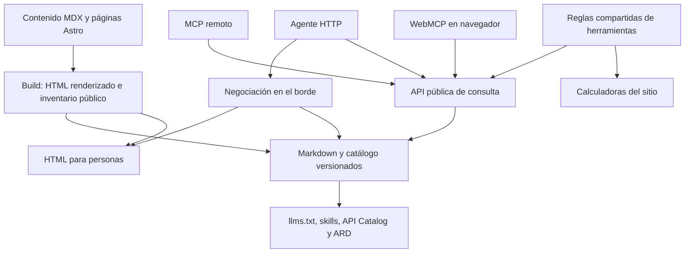

# Arquitectura objetivo

Estado vigente 2026-10-09: F2 aceptada/auditada/publicada,86 contenido/40 general/nivel 4 general, bugs70/71 cerrados ([cierre](evidencia/f2/b/bug71-native-baseline-auditoria/produccion-cierre/resultado.md)). F3 está especificada en [SDD](fases/f3-api-y-descubrimiento.md), [contratos](fases/f3-contratos.md) y [decisiones D11–D20](evidencia/f3/decisiones.md), pendiente de auditoría externa/ratificación; sus capacidades todavía no se presentan como públicas.

## Recorrido que queremos habilitar

Un agente descubre el sitio, consulta su catálogo, encuentra una guía, obtiene Markdown con la URL canónica y las fuentes, y puede utilizar una herramienta mediante un contrato validado. La lectura pública permanece disponible sin identidad de usuario. Las operaciones con coste o efectos requieren su propio tratamiento de acceso.

Es un diseño objetivo, no un diagrama del sistema ya desplegado.

## A01 — Mantener Astro y el adaptador

Conservar Astro 7, `output: 'static'` y el adaptador Cloudflare. La capa de agentes reutiliza los assets generados y el runtime existente. No se necesita otro framework, Vectorize, base de datos nueva ni llamadas a modelos para devolver contenido editorial ya publicado.

Conservar rutas canónicas sin slash final, redirecciones legacy, silos y schema editorial. No crear una segunda edición del contenido para agentes. No actualizar `dateModified` al compilar ni atribuir revisión veterinaria inexistente.

## A02 — Proyección pública única

Producir un inventario explícito de rutas públicas: home, pilares, artículos publicados, herramientas y páginas editoriales relevantes. Excluir admin, mensajes, feedback, datos de contacto, secrets, rutas de API internas y páginas sin intención editorial como `/gracias`.

El inventario alimenta Markdown, catálogo, búsqueda, llms.txt y descriptors. Debe detectar IDs duplicados, URLs no canónicas, archivos huérfanos y contenidos que no deban publicarse. El sitemap indexable puede tener otro alcance; ambos conjuntos se comparan y las diferencias se justifican.

Generar Markdown desde el **HTML ya renderizado**, seleccionando el contenido editorial y conservando títulos, listas, tablas, enlaces, FAQ, avisos y fuentes. Evitar nav, ads, scripts, widgets repetidos y datos de formularios. Para herramientas se publica su explicación y metodología; la ejecución depende del contrato de herramienta.

No usar un LLM para convertir ni una limpieza regex del MDX. Los componentes evaluados por Astro ya aparecen en el HTML, incluidas las FAQs definidas mediante props. La futura spec fijará parser, reglas por tipo de página y ejemplos de paridad antes de encargar implementación.

Cada entrada tendrá identidad estable, tipo, título, descripción, URL canónica, idioma y fecha editorial disponible. La versión de artefacto/hash de build es un dato técnico separado de la fecha editorial. No inventar autoría, revisores, resúmenes clínicos o fuentes.

## A03 — Negociación HTTP en el borde

Concreción F2: [D06–D10](evidencia/f2/decisiones.md) y [contratos](fases/f2-contratos.md). Documentos GET/HEAD se sirven con ASSETS Request para preservar método/validadores; el resto delega Astro. No-store exterior, VaryAccept y representaciones internas separadas; preview pública y producción verifican alternancias. Corpus hasta98 documentos (100 reglas incluyendo API/admin); exceder falla build. No se cambia normativa histórica F0/F1.

Decisión ratificada D01/D04 para la futura SDD F2: servir Markdown precompilado en la **misma URL** mediante `Accept: text/markdown`, con `Vary: Accept`. La [SDD F0](fases/f0-contratos.md) fija para el spike la representación explícita `/agent-content/v1/documents/<documentId>.md` y el índice `/agent-content/v1/index.json`; F2 la incorpora tras ratificar la prueba. Las URLs HTML existentes no cambian.

La ruta debe ejecutarse antes del enrutamiento de assets en las páginas negociables. La documentación actual de Astro permite un entrypoint propio en Wrangler utilizando el handler del adaptador. F0 demostró delegación al handler vigente y a `ASSETS` en workerd; F2 concretará e incorporará esa solución para todo el corpus, con preview pública. No utilizar la opción antigua `workerEntryPoint`, eliminada del adaptador actual.

No convertir todas las páginas en SSR ni activar globalmente `run_worker_first` sin justificar su alcance. La lista de rutas negociables se genera del inventario, manteniendo explícitas `/api/*` y `/admin/*`. Si los límites/configuración del routing no permiten esa lista, la spec deberá resolver la alternativa antes de que un ejecutor empiece.

Reglas obligatorias del contrato futuro:

- Resolver calidad `q`, comodines, exclusión `q=0` y desempate: navegadores normales y `*/*` reciben HTML; Markdown explícitamente preferido recibe Markdown.
- GET/HEAD coherentes; HEAD no lleva body. APIs, assets, admin y métodos de escritura no se negocian como documentos.
- Preservar canónicos, redirects legacy, errores y 404. Una URL inventada nunca devuelve contenido de otra guía con 200.
- Separar HTML/Markdown en la clave de cualquier caché propia; `Vary` por sí solo no demuestra que Cloudflare Cache API separe variantes.
- Mismo aislamiento para ETag/304; no reutilizar el validador de una representación en la otra. Las respuestas autenticadas o privadas no entran en esta caché.
- Preservar cabeceras de seguridad, descartar cabeceras de cuerpo incompatibles y usar MIME/longitud correctos.

Cloudflare Markdown for Agents es una alternativa disponible en ciertos planes. No se conoce el plan de esta zona. Se prefiere la proyección determinista versionada para controlar paridad editorial; no habilitar simultáneamente dos conversiones. Si una prueba favorece la conversión gestionada, registrar el cambio de decisión y adaptar los criterios.

## A04 — Descubrimiento honesto y generado

Concreción propuesta F3: RFC 9727 Linkset+JSON en `/.well-known/api-catalog`, OpenAPI 3.1.1, skills discovery0.2.0 con digest real y una skill de producto. ARD fuente primaria actualv0.91 usa `/.well-known/ard.json`/relard; se conserva además `/.well-known/ai-catalog.json` como fuente compatible del evaluador archivado, mismas entradas. Se anuncian sólo API de lectura y skill; no registry/MCP/auth/cálculos. La divergencia y MIME explícitos se fijan en [contratos §5–6](fases/f3-contratos.md). Ningún descriptor de rama acredita despliegue.

F1 publica `/llms.txt` con descripción, pilares, herramientas, política editorial y enlaces existentes; no requiere `/llms-full.txt` monolítico. Añade Link con relaciones registradas, por ejemplo `describedby` para recursos existentes. F3 añade `api-catalog` y `service-desc` cuando existan sus destinos.

Skills públicas nuevas y específicas describen cómo buscar, leer y citar recursos del sitio y utilizar herramientas publicadas. No publicar `.agents/skills/` directamente: esas skills son de mantenimiento del repositorio, no interfaces de producto. El índice público usa el schema actual, URLs reales y digest SHA-256 de los bytes servidos.

API Catalog sigue RFC 9727 y apunta a una descripción OpenAPI de las capacidades públicas. ARD enumera solo capacidades activas; skills e interfaces deben compartir IDs/URLs con el registro de capacidades. Antes de ampliar el registro, verificar los drafts vigentes y sus schemas. Ningún descriptor anuncia OAuth, MCP o A2A antes de tener una implementación operativa.

La preferencia confirmada es `Content-Signal: search=yes, ai-input=yes, ai-train=no`. F1 define reglas de bots coherentes con búsqueda y lectura, y valida que ninguna regla de grupo específico anule la política deseada. No hace falta duplicar veinte grupos para mantener un pass que ya existe.

## A05 — Consulta pública determinista

La [SDD F3](fases/f3-api-y-descubrimiento.md) cierra catálogo/búsqueda/lectura GET/HEAD con OPTIONS público en `/api/agent/v1/`, sólo IDs del índice F2; lectura devuelve Markdown íntegro+metadata+enlaces originales, búsqueda AND léxica sobre corpus completo, no extractos del asistente. Índice léxico en namespace F3 `/agent-api/v1/query-index.json` evita modificar el orphan detector F2. Hook después de proyección, API sin caché exterior ni fetch externo, corpus guard409, límites y errores exactos; implementación A→B→C tras PASS+ratificación. La ejecución de herramientas del párrafo siguiente sigue siendo F4.

F3 crea contratos versionados de catálogo, búsqueda y lectura, alimentados por la proyección pública. Búsqueda devuelve IDs y URLs verificadas; lectura devuelve documento, metadata, fuentes enlazadas y representación. Validación de entrada, límites y errores estructurados. No aceptar una URL arbitraria para fetch: solo IDs/rutas del inventario.

Mantener el contrato de `/api/assistant-catalog.json` y `/api/ask`. La nueva capa de consulta no usa los extractos truncados como si fueran documentos completos. No expone APIs admin, contacto o feedback mediante los manifests.

Las herramientas comparten funciones de dominio puras con la interfaz. Cada salida conserva versión de metodología, limitaciones y enlaces. La calculadora no decide eutanasia ni transforma puntuaciones en diagnóstico. Antes de portarla se congelan sus reglas actuales y casos frontera; la equivalencia UI/API es criterio de aceptación.

## A06 — Adaptadores WebMCP y MCP

WebMCP registra al cargar la home herramientas reales de búsqueda/lectura; las calculadoras se registran cuando sus contratos compartidos existan. Feature detection de `document.modelContext` con fallback compatible, sin romper navegadores sin soporte. Los contratos y funciones compartidas evitan un segundo algoritmo. No registrar acciones de contacto, cambios administrativos ni envíos automáticos.

MCP remoto usa Streamable HTTP y una implementación mantenida del protocolo. Primera superficie: buscar, leer y ejecutar cálculos puros. La card se publica tras verificar `initialize`, `tools/list`, `tools/call`, errores y límites con cliente compatible. La versión exacta del SDK/protocolo se fijará en su spec; no exige Durable Objects ni sesiones persistentes sin una necesidad demostrada.

No exponer el asistente generativo actual como herramienta remota gratuita por defecto. Eso depende de presupuestos, abuso y decisiones de Assistant V2.

## A07 — DNS, identidad y autenticación

F5 enlaza DNS-AID a capacidades existentes, documenta registros exactos y valida su resolución desde DNS-over-HTTPS. La configuración DNS no vive solo en el repo: requiere acceso a la zona. Comprobar soporte de SVCB/HTTPS, parámetros experimentales y DNSSEC antes de congelar los registros. No inventar registros A2A para un servicio que no existe.

La guía vigente del evaluador describe nivel 5 como nivel 4 más dos de tres: Web Bot Auth, todas las integraciones y metadata de autenticación. No define de forma suficiente qué cubre «todas las integraciones»; el `nextLevel` real tras F4/F5 decidirá el backlog preciso.

F6 es una fase de diseño condicionado, con objetivo explorar 100/100 general y 5/5. Investiga autorización para una operación con necesidad real (por ejemplo una API con coste), OAuth discovery y protected resource metadata correctos, registro de agentes si justifica auth.md y A2A si hay tareas reales que delegar. Debe producir coste, contratos, threat model, mantenimiento y decisión de producto antes de encargar desarrollo.

No añadir un proveedor OAuth, claves de firma o un sistema de tareas únicamente para que el escáner encuentre un JSON. La lectura pública no se bloquea para justificar auth. Web Bot Auth describe identidad de bots emisores; publicar su directorio no habilita automáticamente el acceso de bots visitantes.

## Decisiones resueltas por F0 y límites pendientes

| Pregunta | Prueba necesaria | Salida antes de F2/F3 |
|---|---|---|
| ¿Dónde se intercepta una página estática? | Preview en workerd con adaptador fijado y rutas publicadas | Diseño exacto de entrypoint y delegación |
| ¿Cómo se ejecuta el generador sin efectos de indexación? | Build explícito y artefactos del adaptador | Hook/orden exacto, fallo cerrado y CI |
| ¿Qué selector captura cada tipo de página? | Home, pilar, artículo con FAQ/avisos y herramienta | Reglas y fixtures de conversión |
| ¿Cómo aislar variantes en las dos capas de caché? | HTML→MD→HTML y MD→HTML→MD, validadores | Clave, política y pruebas |
| ¿Qué rutas corresponden a cada entry? | Inventario contra sitemap y rutas generadas | IDs/paths públicos versionados |

F0 pasó su auditoría independiente 3/5. El [cierre arquitectónico](evidencia/f0/cierre-arquitectonico.md) ratifica D01–D05 y conserva los límites: serializador completo, schema final y CDN se verifican en F2. El spike no se promociona. La SDD F1 concreta D02/D05: generación de llms después de sitemap y cardinalidad derivada del corpus público.
