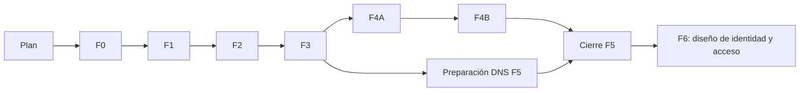

# Plan por fases

Plan aceptado por el propietario; F0 aceptada técnicamente con [PASS 3/5 y ratificación](evidencia/f0/cierre-arquitectonico.md). F1 se concreta en [su SDD](fases/f1-politica-y-descubrimiento.md); aprobada por auditoría independiente PASS 2/2; su lanzamiento requiere SHA fijo en el issue. Las cifras futuras son estimaciones con la selección actual del evaluador congelada; se recalculan con evidencia después de cada promoción. El estado de ejecución de F0 vive en [su SDD](fases/f0-medicion-y-contratos.md), con [contratos](fases/f0-contratos.md), [prompts](fases/f0-prompts.md) y [registro de reanudación tras el bug #45](fases/f0-reanudacion-2026-10-05.md).

## Orden y dependencias

| Fase | Resultado | Dependencias | Hito de puntuación previsto |
|---|---|---|---|
| F0 — Medición, inventario y decisiones de entrega | Evidencia repetible y contratos técnicos congelados | Plan | Línea base: 43 contenido / 20 general |
| F1 — Política y descubrimiento básico | Content Signals, llms.txt y Link funcional | F0 | 71 contenido / 33 general; nivel 2 |
| F2 — Lectura íntegra y negociación Markdown | Proyección pública, routing y caché correctos | F1 y decisiones F0 resueltas | 86 contenido / 40 general; nivel 3 |
| F3 — API y skills de producto | Catálogo, búsqueda/lectura, OpenAPI, skills y ARD | F2 | 60 general; nivel 4 previsto |
| F4A — Herramientas compartidas y WebMCP | Paridad UI/API y registro en navegador | F3 | 67 general |
| F4B — MCP remoto | Servidor real, transporte y card | F4A | 73 general |
| F5 — DNS y verificación pública | DNS-AID y auditoría del acceso en producción | F3; cierre después de F4B | **100 contenido / 80 general**, nivel 4 previsto |
| F6 — Diseño de identidad y acceso | Decisión sobre OAuth/Auth.md/A2A y máximo nivel | F5 y `nextLevel` actualizado | Objetivo explorar **100 general / nivel 5** |

F1 añade dos controles, F2 uno, F3 tres, F4A uno, F4B uno y F5 uno. El cálculo general asume 15 controles puntuables y que los neutrales/comercio no cambian. F6 puede cambiar el denominador; no se predice su score sin medir.

La preparación documental de DNS puede correr mientras se implementan herramientas/MCP. La aplicación de DNS se hace cuando sus destinos estén publicados. No hay otros solapamientos de implementación autorizados por este plan.

## F0 — Congelar la medición y despejar arquitectura

Entregar un harness de auditoría, perfiles explícitos, inventario de rutas y contratos de artefactos. Debe guardar request, JSON original, timestamp, commit, IDs habilitados, neutrales y fórmula; comparar cambios de controles antes de comparar puntuación.

Una sesión exploratoria prueba la delegación del entrypoint del adaptador, la lectura de assets en preview, el orden del build y el aislamiento de caché, sin promocionar el spike a producción. El coordinador convierte los resultados en decisiones exactas para F2. F0 también congela qué texto y fuentes deben sobrevivir para home, pilar, artículo MDX con FAQ/AlertBox y herramienta.

Ownership concreto en la SDD: `scripts/agent-readiness/`, tests/fixtures y evidencia F0, dos devDependencies directas ya presentes transitivamente y dos pasos offline de CI. F0 posee temporalmente esos archivos compartidos, en serie. El spike vive en un worktree temporal con su diff adjunto; sus cambios de runtime no se fusionan al producto. No se introducen hooks de indexación.

Aceptación: la puntuación de los JSON actuales se reproduce; una diferencia entre selección de UI y API se detecta; inventario justificable frente a sitemap; resueltas las cinco preguntas de arquitectura A07/F0. Reversión: quitar el harness/spike, sin cambio de producto.

## F1 — Política y descubrimiento

Entregar política confirmada en robots, llms.txt con enlaces reales, Link de descubrimiento y copia HTML de enlaces útiles en head cuando corresponda. No anunciar APIs o capacidades futuras. Mantener sitemap y URLs legacy.

Ownership concretado por la SDD F1: robots, _headers, middleware para headers Worker, integración final de Astro, generador de descubrimiento, evolución acotada del inventario, tests y check offline de CI. Se sustituye el endpoint prerenderizado propuesto por generación después de sitemap: necesita HTML del mismo build. No hace falta cambiar el head ni la arquitectura de enlaces internos.

Aceptación de implementación: política exacta, llms construido con enlaces canónicos, headers en assets/Worker, tests/build/workerd/CI y auditoría independiente. Publicación posterior: HTTP público y scans verifican Content Signals/Link y conservan los tres passes previos. Esta separación permite desarrollar sin desplegar ni atribuir cambios de una rama a producción.

Reversión: commit de política/headers/llms, conservando la evidencia histórica. La política elegida no se cambia incidentalmente al revertir otra fase.

## F2 — Markdown y publicación determinista

Entregar generador basado en HTML renderizado, índice público, documentos Markdown, URL explícita de representación y negociación en la URL canónica. Definir selección de contenido, renderizado de enlaces/tablas/FAQ/avisos, normalización de URLs, headers, validators y límites en la spec.

Ownership previsto: `scripts/agent-readiness/`, `src/lib/agent-content/`, entrypoint propio propuesto `src/worker.ts`, `src/middleware.ts`, `wrangler.jsonc`, ajustes estrictamente necesarios de `astro.config.mjs`, `package.json`/lock, CI y tipos Worker. Estos archivos son **exclusivos de la sesión de plataforma durante esta fase**. Ninguna sesión Assistant V2 los modifica a la vez.

Aceptación: todos los documentos negociables responden Markdown con MIME correcto; home pasa el control; pruebas de preferencias Accept y HEAD; alternancia HTML/Markdown con caché caliente en ambos órdenes; redirects/404 correctos; paridad de títulos, avisos, FAQ y fuentes en fixtures y muestreo de todas las rutas. El JSON-LD y la presentación HTML no sufren cambios editoriales.

El build falla si falta un documento público esperado; no genera assets a mano después del deploy. El generador debe correr en el camino real de Cloudflare Workers Builds, que actualmente usa `npx astro build`; solo cambiar un script npm que ese build no llama sería insuficiente.

Reversión: entrypoint/enrutamiento y generador como cambio coherente. No borrar redirecciones ni volver a una caché que mezcle representaciones. Artefactos huérfanos se detectan al construir.

## F3 — Contratos públicos de contenido

Entregar API versionada para catálogo/búsqueda/lectura, OpenAPI, API Catalog, skills públicas con digests y ARD. La spec fijará rutas, JSON schemas, IDs, errores, límites de payload/resultados, consistencia de versión y CORS. El manifiesto enumera lo ya implementado; F4 lo amplía después.

Ownership previsto: módulos `src/lib/agent-content/`, endpoints nuevos dentro de `src/pages/api/agent/`, `src/pages/.well-known/` o sus equivalentes estáticos congelados por la spec, `src/agent-skills/`, scripts generadores y pruebas de contrato. `public/_headers` y head se integran secuencialmente. No sobrescribir el catálogo del asistente V1.

Aceptación: una consulta devuelve una guía relevante del corpus, su URL resuelve y la lectura incluye texto completo; errores para IDs inexistentes/inputs inválidos; ninguna lectura arbitraria de URL; manifests y OpenAPI validan; cada digest coincide con bytes HTTP; cada skill tiene un recorrido reproducible; API Catalog, skills y ARD pasan el escáner.

Reversión: retirar los endpoints y descriptors asociados juntos; llms/Link/ARD no pueden dejar referencias rotas.

## F4A — Herramientas y WebMCP

Entregar funciones compartidas para las dos herramientas y contratos públicos de cálculo. Empezar por búsqueda/lectura en WebMCP y añadir cálculos cuando haya paridad. No exigir que el agente manipule sliders para obtener un resultado.

Ownership previsto: `src/lib/agent-tools/`, nuevas rutas API de herramientas, `src/scripts/agent-tools.ts` (nombre propuesto), `src/pages/herramientas/*.astro`, punto de registro en home/layout y OpenAPI/manifest. La sesión posee las páginas de herramientas durante esta fase. El head compartido se integra en una sola sesión.

Aceptación: fixtures de valores mínimos, máximos, inválidos y umbrales producen el mismo resultado que la UI; no se altera metodología; tools visibles al cargar home en navegador compatible; navegador sin API funciona; cancelación/errores validados. El control WebMCP pasa en el escáner y las llamadas reales funcionan. Formularios con efectos no se registran.

Reversión: desregistrar WebMCP y quitar nuevos endpoints, preservando las calculadoras funcionales. Una extracción de lógica se revierte con su adaptador UI, sin dejar versiones distintas.

## F4B — MCP remoto

Entregar MCP Streamable HTTP con búsqueda, lectura y cálculos puros; server card generada; actualización del registro y ARD. La spec fijará capacidades, schemas de tools, transporte, versión del SDK, errores, protección de abuso y presupuestos.

Ownership previsto: `src/lib/agent-mcp/`, endpoint `/mcp` según contrato final, card estática, registro de capacidades y configuración/routing exclusivamente necesarios. Integración secuencial de archivos compartidos.

Aceptación: cliente compatible inicializa, lista y ejecuta herramientas; las respuestas coinciden con API/UI; IDs inválidos no llegan a lecturas arbitrarias; límites de body/request/resultado definidos y comprobados; card apunta al transporte correcto; control MCP pasa. Sin generación de pago implícita ni escritura administrativa.

Reversión: despublicar transporte/card y retirarlos del registro. API y WebMCP permanecen funcionales cuando sus contratos no hayan cambiado.

## F5 — DNS y auditoría de extremo a extremo

Entregar cambios DNS exactos y evidencia de zona/resolución, revisión de reglas reales de acceso y evaluación posterior al deploy. Determinar soporte de SVCB/HTTPS y estado DNSSEC; especificar parámetros con referencia al draft vigente.

Ownership previsto: `docs/agent-readiness/dns/`, configuración de zona aprobada por su propietario, evidencia F5 y ajustes solo si una spec describe el fallo. No cambiar código para disimular un fallo de zona.

Aceptación: DNS-AID pasa; registros resuelven a capacidades funcionales; 7/7 del perfil Content Site; nuevos scans generales con la selección inicial idéntica; agente HTTP descubre→busca→lee→cita y cliente MCP calcula. WAF se revisa por función/identidad, sin desactivar protecciones de contacto/admin para permitir lectura pública.

Reversión: restaurar registros previos y cualquier regla de zona cambiada; registrar propagación y TTL. No depende de eliminar contenido publicado.

## F6 — Máxima preparación e identidad

Es un diseño posterior, no un encargo de construir auth inmediatamente. Leer `nextLevel` en el estado ya publicado y mapear fallos restantes. Estudiar:

- OAuth discovery y protected resource para una capacidad que de verdad requiere autorización.
- Auth.md con registro y credenciales realmente utilizables, si esa interfaz tiene sentido.
- A2A para tareas concretas y Web Bot Auth para solicitudes salientes firmadas, si son necesarios para nivel 5 y aportan valor.
- Costes, revocación, scopes, protección de datos, soporte operativo y coexistencia con Assistant V2.

Salida: ADR con opción recomendada y coste; specs de subfases solo tras decidir el producto. Si se decide implementar, el objetivo es que cada pass refleje una función demostrable y medir 100 general/nivel 5. Si alguna función carece de utilidad, registrar la brecha y el techo obtenido; no etiquetar ese techo como «máximo posible» sin justificarlo.

## Reglas de entrega para todas las fases

Una fase entrega PR, commit exacto, diff contra su base, lista de criterios con evidencia, limitaciones y procedimiento de rollback. Revisor distinto del ejecutor para verificar resultados. El coordinador revisa contrato y arquitectura; los desarrolladores corrigen.

No fusionar a `main` como parte de la implementación sin autorización para la promoción, porque publica el sitio. Mantener la base actualizada de forma deliberada entre fases; evitar ejecutar contra la rama histórica de migración. No hay estimaciones de duración fiables antes de resolver F0: la mayor incertidumbre está en routing/caché, paridad de herramientas e identidad.
