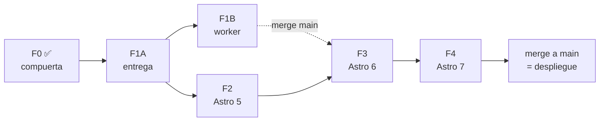

# Migración de stack: Astro 4 → 7 sobre Cloudflare Workers

**Spec de producto.** Manda sobre las specs de fase; si una fase la contradice,
gana este documento y hay que corregir la fase.

**Estado:** fase 0 cerrada ([PR #9](https://github.com/Gunz-cop/CuidaTuPerroViejo/pull/9)).
Fases 1 a 4 pendientes.

---

## El porqué

`cuidatuperroviejo.com` corre Astro 4.16.19 —que es literalmente el dist-tag
`legacy` en npm— con `@astrojs/cloudflare` 11. Cada dependencia está clavada por
la siguiente: el pin de `wrangler@~4.107.0` que hubo que poner para desbloquear
`npm ci` era el síntoma, no el problema.

Al mismo tiempo, el proyecto se comporta como un sitio de Cloudflare **Pages**
aunque despliegue como **Worker**, y eso deja rendimiento y seguridad sobre la
mesa que no dependen de la migración.

La auditoría completa, con los 24 hallazgos y su evidencia, está en el informe
publicado el 2026-08-30. Este documento es el plan de ejecución.

## El destino

La base normalizada de la skill compartida
`upgrade-astro-cloudflare` (en `Proyectos/Generalidades`, instalada en
`~/.claude/skills/`). No se redefine aquí: **si hay discrepancia entre este
documento y la skill sobre *cómo* se configura algo, gana la skill**, y hay que
actualizar este documento.

En corto: Astro 7 + `@astrojs/cloudflare` 14 sobre `output: 'static'`,
`main` apuntando a `@astrojs/cloudflare/entrypoints/server`, bindings por
`cloudflare:workers`, Tailwind por `@tailwindcss/vite`.

## Decisiones cerradas, con su motivo

| Decisión | Motivo |
|---|---|
| **Se sigue con el adaptador**, no con un Worker escrito a mano | El criterio fue «la mejor práctica vigente, no la que ya estaba hecha en otro repo». El adaptador 14 admite entrypoint propio, así que no hay que elegir entre el pipeline de Astro y un Worker propio. `fuenteai.com` resolvió esto sin adaptador y funciona, pero no es el estándar a replicar |
| **Un major por PR** | Si algo se rompe con dos majors en el mismo PR, no hay forma de saber cuál lo trajo |
| **Un commit por motivo dentro de cada PR** | Para poder revertir uno sin arrastrar el resto. Así se separó TypeScript 7 del trabajo de Astro en el repo hermano |
| **La plataforma va antes que las versiones** | Los arreglos de cabeceras, rate limit y tamaño del Worker son válidos en Astro 4 y sobreviven intactos a las cuatro fases. Hacerlos primero reduce el riesgo de las siguientes |
| **El método vive en la skill, la evidencia en `docs/migracion-stack/`** | Hay ocho repos Astro pendientes. Escribir procedimiento aquí lo condena a reescribirse en cada uno y a diverger |
| **Quien migra no verifica** | Regla de `AGENTS.md`. El que ejecutó tiene interés en que haya salido bien |

## Ramas

**`main` despliega a producción.** Cloudflare Workers Builds está conectado al
repositorio: cada push a `main` construye y publica. Eso condiciona todo lo
demás.

| Fase | Rama base del PR | Motivo |
|---|---|---|
| **1 — plataforma** | `main` | Mejoras independientes y completas. Cada una puede estar en producción el día que se fusiona |
| **2, 3, 4 — versiones** | `migracion/astro-7` | Un Astro a medio migrar no debe llegar a producción, y el verificador tiene que mirar antes de que llegue |

La rama de integración `migracion/astro-7` se crea desde `main` cuando la fase 1
esté fusionada, y se fusiona a `main` de una sola vez cuando la fase 4 haya
pasado la verificación completa.

**Ninguna fase abre PR contra `main` salvo la 1.**

## Las fases

| | Fase | Spec | Issue | Rama base | Depende de |
|---|---|---|---|---|---|
| ✅ | 0 — Compuerta y línea base | [`fase-0-compuerta.md`](fase-0-compuerta.md) | [#9](https://github.com/Gunz-cop/CuidaTuPerroViejo/pull/9) | `main` | — |
| 🟢 | 1A — Entrega y configuración | [`fase-1a-entrega.md`](fase-1a-entrega.md) | [#11](https://github.com/Gunz-cop/CuidaTuPerroViejo/issues/11) | `main` | F0 |
| 🔒 | 1B — Worker: tamaño, abuso y datos | [`fase-1b-worker.md`](fase-1b-worker.md) | [#17](https://github.com/Gunz-cop/CuidaTuPerroViejo/issues/17) | `main` | F1A |
| 🔒 | 2 — Astro 4 → 5 | [`fase-2-astro-5.md`](fase-2-astro-5.md) | [#12](https://github.com/Gunz-cop/CuidaTuPerroViejo/issues/12) | `migracion/astro-7` | F1A |
| 🔒 | 3 — Astro 5 → 6 | [`fase-3-astro-6.md`](fase-3-astro-6.md) | [#13](https://github.com/Gunz-cop/CuidaTuPerroViejo/issues/13) | `migracion/astro-7` | F2 + F1B |
| 🔒 | 4 — Astro 6 → 7 | [`fase-4-astro-7.md`](fase-4-astro-7.md) | [#14](https://github.com/Gunz-cop/CuidaTuPerroViejo/issues/14) | `migracion/astro-7` | F3 |

🟢 lista para tomar · 🔒 bloqueada. La rama `migracion/astro-7` ya existe, creada desde `main`.

> **El estado vive en las etiquetas de los issues, no en esta tabla.** Si divergen, gana el issue: en el proyecto anterior una columna de estado duplicada derivó de la realidad en menos de un día.

## El mapa



**F1A es el cuello de botella y por eso es corta.** En cuanto esté fusionada,
**F1B y F2 corren a la vez, en dos sesiones distintas**. Es el único paralelismo
real de la migración, y no es casualidad: las specs de esas dos fases se
repartieron los ficheros a propósito para conseguirlo.

## Qué puede ir en paralelo, y por qué

El paralelismo sale de la **propiedad de ficheros**, no de las ganas. Estas son
las intersecciones reales:

| Par | ¿Paralelo? | Ficheros en común |
|---|---|---|
| **F1B ∥ F2** | **Sí** | ninguno |
| F1A ∥ F1B | No | F1B usa los bindings que F1A declara en `wrangler.jsonc` |
| F1A ∥ F2 | No | `package.json` |
| F2 ∥ F3 ∥ F4 | No | `package.json`, `astro.config.mjs`, y cada salto se apoya en el anterior |

**Cómo se consiguió F1B ∥ F2.** Tres decisiones concretas, no un descubrimiento:

1. **F1A declara los bindings de rate limit pero no los usa.** Así F1B no tiene
   que tocar `wrangler.jsonc`, que es de F1A.
2. **F1B no edita `src/lib/assistant/catalog.ts`.** El endpoint nuevo importa
   `getArticleCatalog()` sin modificarlo, así que ese fichero queda entero para
   F2, que sí lo migra a la Content Layer API.
3. **F1B no toca `package.json`.** Ni scripts ni dependencias.

Si una de las dos sesiones se sale de su lista de «Archivos que posee», el
paralelismo se pierde y aparece un conflicto. Por eso las dos specs tienen un
criterio de aceptación que compara el diff contra esa lista.

## El punto de reunión de las dos ramas

F1A y F1B van a `main`. F2, F3 y F4 van a `migracion/astro-7`, que se creó de
`main` **antes** de que F1A se fusionara. Las dos ramas divergen, y hay que
volver a juntarlas.

**El orden importa, y no es el intuitivo.** La tentación es fusionar `main` en la
rama de integración en cuanto haya algo nuevo. Es un error:

```
  1. F2 se verifica contra la base sobre la que se construyó   ← NO tocar la base antes
  2. Se fusiona el PR de F2 en migracion/astro-7
  3. Se fusiona main en migracion/astro-7                       ← aquí, y en un commit propio
  4. Se verifica ESE merge por separado
  5. Empieza F3
```

Si se fusiona `main` en la rama de integración mientras la verificación de F2
está pendiente, el verificador ve a la vez los cambios de F2 y los de F1A —
cabeceras nuevas, middleware distinto, otro bundle— y **no puede atribuir
ninguno**. Es exactamente la trampa que `references/verificacion.md` de la skill
llama «para atribuir un cambio, construí las dos versiones sobre la misma base».

El paso 4 no es ceremonia: F1A tocó `src/middleware.ts`, `wrangler.jsonc` y
`public/_headers`, y F2 migró el sitio a Astro 5. Que git funda los dos sin
conflictos textuales no prueba que el resultado funcione.


## El paralelismo que de verdad escala

Dentro de este repositorio solo hay un par de fases que puedan solaparse. **El
paralelismo grande está entre repositorios:** hay ocho repos Astro pendientes y
la skill `upgrade-astro-cloudflare` es la misma para todos. Nada impide que
`HouseGatitos` o `RuletaWeb` avancen a la vez que este, en sesiones
independientes, porque no comparten un solo fichero.

Este repositorio es además el más atrasado de los ocho, así que sirve de banco de
pruebas del método: lo que aparezca aquí se recoge en la skill y abarata los
otros siete.

## Cómo se lanza una sesión

La plantilla de prompt —ejecutor, verificador y coordinador— está en la skill:
`~/.claude/skills/upgrade-astro-cloudflare/templates/prompt-sesion.md`. Cada
issue trae además su versión ya rellenada.


## Roles

| Rol | Quién | Qué hace |
|---|---|---|
| **Coordinador** | una sesión, la que escribió estas specs | Escribe y corrige specs, revisa PRs. **No escribe código de producto** |
| **Ejecutor** | una sesión por fase, puede ser otro modelo | Implementa una fase, abre un PR, termina |
| **Verificador** | una sesión **distinta** de la que ejecutó | Corre la escalera de `verificar-upgrade`. **No corrige**: describe y devuelve |

En el proyecto anterior con este método, cinco de los seis problemas de fondo
los causó la spec y no el ejecutor, y **ninguno de los tres modelos reportó el
bloqueo cuando la spec no tenía salida**: todos buscaron la rendija. Por eso:

> **Si una sesión no puede terminar leyendo solo su spec, el bug es de la spec.**
> Comentalo en el issue y parate. No se compensa improvisando.

## Verificación

Cada fase de versión (2, 3 y 4) cierra con la escalera de cinco peldaños de
`references/verificacion.md` de la skill, corrida por el rol verificador contra
la línea base.

**La línea base es el commit `ac7a9bb`** (`main` con la fase 0 fusionada).
Regenerable en cualquier momento:

```bash
git worktree add ../ctpv-base ac7a9bb
cd ../ctpv-base && npm ci && npx astro build
```

No uses `npm run build` para la línea base mientras exista el hook `postbuild`
(ver fase 1).

El reporte separa siempre tres cosas: **idéntico**, **diferencia aceptada** (con
el motivo por el que es aceptable) y **no verificado**.

## Lo que no se toca

Parece deuda técnica en una lectura rápida y no lo es. Ninguna fase lo modifica:

- **`public/_redirects`** — 24 redirecciones 301 desde las URLs de Blogger. Es
  autoridad SEO acumulada y no caduca.
- **`build.format: 'file'` + `trailingSlash: 'never'` + la normalización del
  canónico en `BaseLayout`** — funcionan como un conjunto. Cambiar uno mueve
  todas las URLs del sitio.
- **La lógica de `dateModified`** — nunca se usa la fecha de build, para no
  declarar una revisión editorial que no ocurrió. Es una decisión editorial.
- **La autoría de organización sin `jobTitle` en el schema `BlogPosting`** —
  deliberada: el equipo no son veterinarios en ejercicio.
- **`AdNativeBanner.astro` vacío** — pausado a propósito, con el motivo en el
  propio archivo.
- **`src/data/internal-links.ts` y la arquitectura de silos** — tienen su propia
  skill y su documentación en `docs/seo/enlazado-interno.md`.
